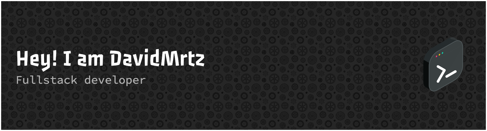

# 💫 About Me:
I have 3 years of experience as a Full Stack developer, specializing in React, using Next.js as my main framework. To ensure more robust, scalable, and maintainable code, I primarily work with TypeScript. For styling, my default tool is Tailwind, as I consider it one of the most complete, versatile, and efficient libraries for frontend development.  Throughout my career, I have had the opportunity to collaborate on projects for internationally recognized companies, such as Wendy's and Papa John's, contributing to the development and optimization of their e-commerce platforms in Honduras. In these projects, I put my knowledge of the aforementioned technologies into practice, actively participating in the entire development cycle, from project architecture to the implementation of key functionalities focused on user experience and application performance.  My professional approach focuses on creating efficient, scalable digital solutions with excellent user experience, always staying updated with the latest trends and best practices in development. 

## 🌐 Socials:
    

# 💻 Tech Stack:
                           
